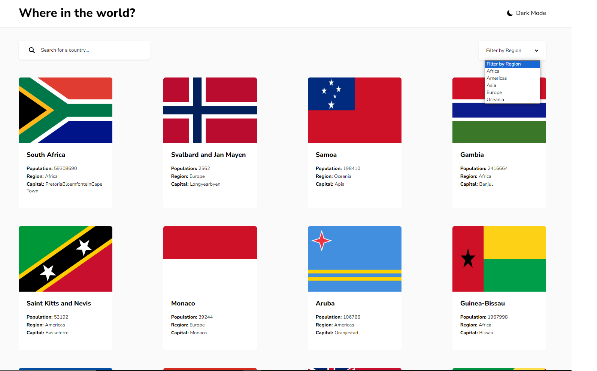

# REST Countries API with color theme switcher solution

[Front end mentor solution](https://www.frontendmentor.io/solutions/responsive-rest-countries-api-reactjs-typescript-X3vP0g5A8E)



This is a solution to the [REST Countries API with color theme switcher challenge on Frontend Mentor](https://www.frontendmentor.io/challenges/rest-countries-api-with-color-theme-switcher-5cacc469fec04111f7b848ca). Frontend Mentor challenges help you improve your coding skills by building realistic projects.
### Links

- Solution URL: [Front end mentor](https://www.frontendmentor.io/solutions/responsive-rest-countries-api-reactjs-typescript-X3vP0g5A8E)
- Live Site URL: [Rest Countries](https://heroic-clafoutis-096f30.netlify.app/)

## Overview

### The challenge

Users should be able to:

- See all countries from the API on the homepage
- Search for a country using an `input` field
- Filter countries by region
- Click on a country to see more detailed information on a separate page
- Click through to the border countries on the detail page
- Toggle the color scheme between light and dark mode *(optional)*

## My process

### Built with

- [React](https://reactjs.org/) - JS library
- TypeScript
- [Styled Components](https://styled-components.com/) - For styles
- Axios
- Context Api with reducer
- react router dom
- react icons

## Run the project

```
  git clone
  npm install
  npm run dev
```
